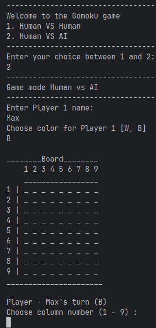
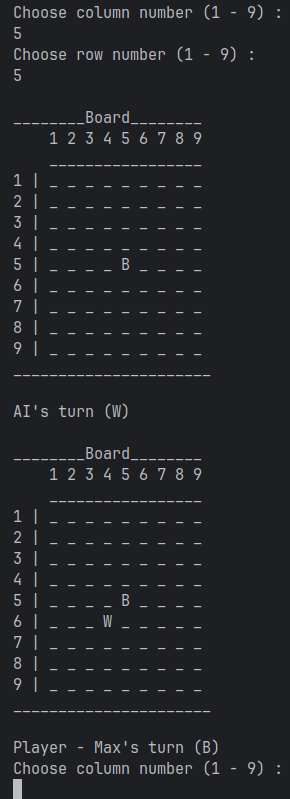

# Gomoku Game

## Description

A fully functional, terminal-based Gomoku (Five in a Row) game written in Java. This project features a robust Object-Oriented design and supports both **Human vs Human** local multiplayer an **AI opponent** powered by the **Minimax algorithm with Alpha-Beta pruning** and a custom heuristic evaluation engine

## Demo

    
    

